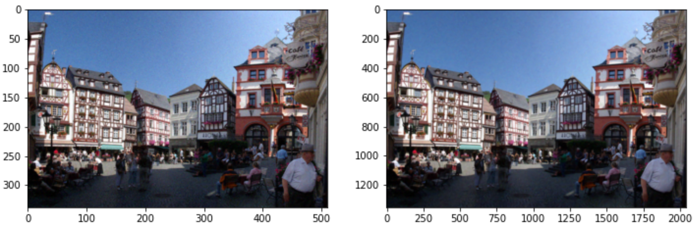

# ImageSR
**IMPORTANT**  
Codes are cloned from [Tencent-RealSR](https://github.com/jixiaozhong/RealSR) project.  
In order to apply a model with very nice performance to the project, the cloned code was partially modified and fit to the project.  
And also added [ESRGAN](https://github.com/xinntao/ESRGAN), but currently **only provides [RealSR](https://github.com/jixiaozhong/RealSR) testing code**.  

**About ImageSR**  
ImageSR is a part of the "[Sharpic](https://github.com/GCU-Graduate-Project-Sharpic/Sharpic)", which automatically generate HQ image from LQ images. (Less than 2K).  
By using RealSR's kernel-estimation method, we were able to train by preparing a great dataset for the **real world**.  

  
We use super resolution algorithms below
- [EDSR (cv)](https://github.com/sanghyun-son/EDSR-PyTorch)
- [ESPCN (cv)](https://github.com/Lornatang/ESPCN-PyTorch)
- [Tencent RealSR](https://github.com/jixiaozhong/RealSR)
- [ESRGAN](https://github.com/xinntao/ESRGAN)
- [OpenCV & OpenCV contrib](https://github.com/opencv/opencv)

**We also want to train above algorithms(EDSR & ESPCN) using RealSR's dataset generator.**  

## Pre-requirements for usage(**ONLY** for RealSR)  

To test SR method, you should use NVIDIA GPU.  
Therefore it's requrements are different for each environment, so I **strongly recommend** you to use Colab condition.  

### For Colab condition  
Just clone it into your google drive, and run it using Colab terminal.  

### For specific condition  
Or, if you want to use your own environment, then you should follow [this link](https://pytorch.org/get-started/locally/) and install corresponding version of torch and run `torch.cuda.is_available()` to check if GPU is available.  

All the other requirements can be matched from below. 
- Python packages: `pip install numpy opencv-python lmdb pyyaml`  
- TensorBoard:  
PyTorch >= 1.1: `pip install tb-nightly future`  
PyTorch == 1.0: `pip install tensorboardX`

## Training environment 
> NVIDIA GPU & CUDA  
> pytorch 1.12    

> `Time consumption (NVIDIA Tesla P100): (6H 30M)`  

## How to test  
**IMPORTANT**  
It cause error while getting PSNR value. But other things works properly, so don't worry about PSNR value error. The result images can be found in `../result/` folder.  
1. After clone repository, open `/trained_model/pre_trained_model.txt` file, which contains trained-model download link. Or, follow [this link](https://drive.google.com/drive/folders/16A58T1IfKq5OLEWWEWRLBucPR3QlAn6P?usp=sharing) to directly go to the link.  

2. Download trained GAN model.  
   i)  **DF2K.pth**  
   ii) **latest_G_rgb.pth** <- Recommended
   
3. Place the downloaded model into `/trained_model/` folder.  

4. Download test LQ image from [this link](https://drive.google.com/drive/folders/1dNm4yilKnKB_oQJrWQHygeehtQVSzB7J?usp=sharing). 

5. Place all the images into `/datasets/LQ_te/` folder and **DELETE text file in folder**.  

6. Open `codes/options/df2k/test_df2k.yml` and set below things.  
   i)   gpu_ids: [N]  
   ii)  name: whatever you want  
   iii) path:  
           pretrained_model_G: if you downloaded DF2K.pth, then set it as DF2K. else, do nothing.
           
7. Run below command(0 for 1 GPUs, set as you want if you have GPU > 1)  
   `cd codes/` then  
   `CUDA_VISIBLE_DEVICES=0 python3 test.py -opt options/df2k/test_df2k.yml`  
   The result will be in `../results/your_name/` folder.  
   

## Sample images (DIV2K 998)  
- DIV2K 998 image (LR : HR), RealSR with Kernel Estimation  
  

- DIV2K 998 image (LR : HR), EDSR without Kernel Estimation  

# -------------------------Will be trashed---------------------------
## Docker settings (No longer support. Please follow upper Pre-requirements. )

**IMPORTANT**  
> You can just simply clone the [Sharpic Repository](https://github.com/GCU-Graduate-Project-Sharpic/Sharpic) then build using makefile.  
> Or, if you want to simply run this SR method, You should follow below information.  

> 1. Build docker file  
> `docker build -t built_dockerfile .` (You can freely change the name of `built_dockerfile`)  
> 
> 2. Run to save docker images into repository  
> `docker run -itd --name torch_docker -v /home/hyun/share:/root/share -p 8888:8888 --restart=always built_dockerfile`  
> In above command, you can freely change `hyun` as your account ID and  
> `built_dockerfile` as name which you changed above.  
> 
> (Optinal) To use jupyter notebook as editor, follow below commands.  
> `conda install jupyter` <-- Install jupyter notebook in your docker  
> `jupyter notebook --ip=0.0.0.0 --port=8888 --allow-root` <-- Connect to your port
