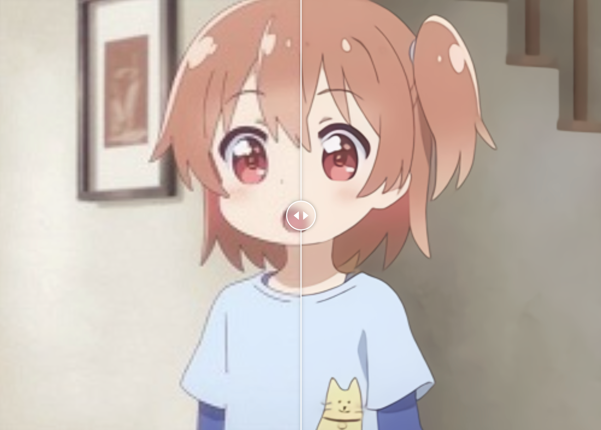

# Sharpie - Image Super Resolution

Sharpie is a novel cloud-based image restoration service that combines advanced deep learning techniques, specifically RealSR, Waifu2X, and Bringing Old Photos Back to Life, with the accessibility and scalability of cloud computing. The service caters to a wide range of use-cases such as restoring old photographs, improving low-resolution images, and enriching digital media content.

## Result 

### waifu2x-ncnn-vulkan


### tencent-realSR


### microsoft-bring-old-photos-back-to-life


## Usage 

### 1. Install

```bash
$ git clone https://github.com/GCU-Sharpic/sharpic-imagesr
$ cd sharpic-imagesr
```

### 2. Run

```bash
$ python main.py 
```


## Additional Information 

Our aim with Sharpie is to democratize access to state-of-the-art image restoration techniques. By providing a user-friendly platform, we make it possible for users with varying levels of expertise to benefit from these advanced models without needing extensive technical knowledge. Our cloud-based architecture ensures scalability, allowing the service to handle diverse user demands and adapt to future developments in the field. The impact of Sharpie on the digital content industry is significant as it makes cutting-edge image restoration capabilities accessible to a wider audience.

## Model Description 

In Sharpie, we make use of three primary models for image restoration and super-resolution:

1. RealSR, developed by Tencent, is a super-resolution model that uses a Generative Adversarial Network (GAN) architecture and a Laplacian Pyramid-based Kernel Prediction mechanism to effectively enhance low-resolution images.
   
2. Bringing Old Photos Back to Life (BOPB) from Microsoft restores color, texture, and structure to old photos using a combination of GANs, unsupervised learning, and deep reinforcement learning.

3. Waifu2X-Vulkan, based on the Waifu2X algorithm, is a model for image super-resolution and noise reduction that excels in improving the quality of digital 2D images.

These models are integrated into our cloud service to provide top-notch image restoration and super-resolution to our users.

## License 

This project is licensed under the terms of the MIT License.
