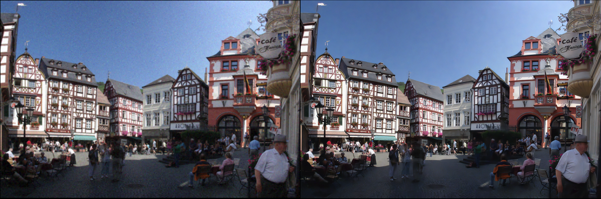
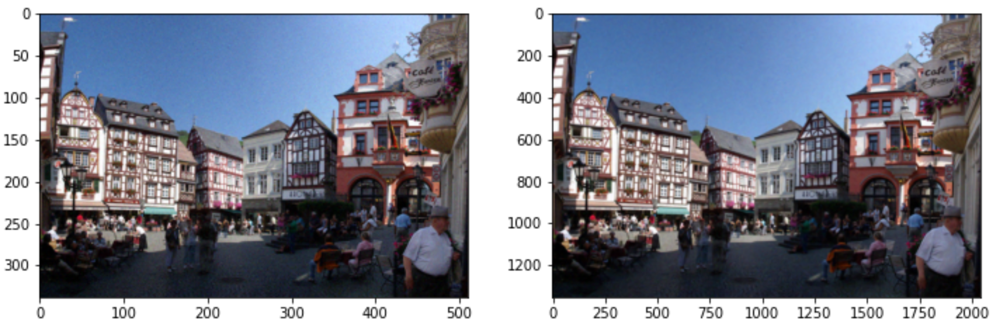

# ImageSR
**IMPORTANT**  
Codes are cloned from [Tencent-RealSR](https://github.com/jixiaozhong/RealSR) project.  
In order to apply a model with very nice performance to the project, the cloned code was partially modified and fit to the project.  

**About ImageSR**  
ImageSR is a part of the "[Sharpic](https://github.com/GCU-Graduate-Project-Sharpic/Sharpic)", which automatically generate HQ image from LQ images. (Less than 2K).  
By using RealSR's kernel-estimation method, we were able to train by preparing a great dataset for the **real world**.  

  
We use super resolution algorithms below 
- [Tencent RealSR](https://github.com/jixiaozhong/RealSR)
- [OpenCV & OpenCV contrib](https://github.com/opencv/opencv)

## Pre-requirements for usage(**ONLY** for RealSR)  

To test SR method, you should use NVIDIA GPU.   

### Local condition
If you want to use your own environment, then you should follow [this link](https://pytorch.org/get-started/locally/) and install corresponding version of torch and run `torch.cuda.is_available()` to check if GPU is available.  

In ARM Mac, you can simply install CPU version of torch, then change device from 'cuda' into 'mps'  

All the other requirements can be matched from below. 
- Python packages: `pip install numpy opencv-python lmdb pyyaml`  
- TensorBoard:  
PyTorch >= 1.1: `pip install tb-nightly future`  
PyTorch == 1.0: `pip install tensorboardX`

## Training environment 
> NVIDIA GPU & CUDA  
> pytorch 1.12    

> `Time consumption (NVIDIA Tesla P100): (6H 30M)`  

## How to test  
**IMPORTANT**  
You should set some variable related to server.  
e.g) host ip, password, ...  

1. move into connects  
`cd connects`  
2. run below command  
`python3 main.py`  

Then, it will automatically connected with server, upscale images and upload recon-hr images into server.  

If you more interested in RealSR, please refer original site.  
   

## Sample images (DIV2K 998)  
- DIV2K 998 image (LR : HR), RealSR with Kernel Estimation  
  

- DIV2K 998 image (LR : HR), EDSR without Kernel Estimation  

